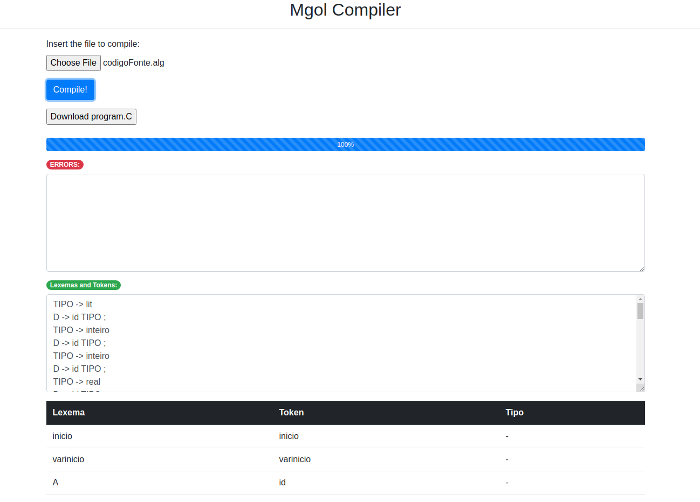

# Compiler

Compiler developed in Javascript that compiles the Mgol language and generates source code in C language.

The compiler discipline is concerned with studying techniques and theories for building a compiler. To this end, during the semester we learn about its components, studying theoretical and practical aspects in a case study. As the final product of the course, my fellow undergraduate [Bruno César](https://github.com/brunocesaromax) and I developed a compiler that receives as input a source file in the Mgol language, performs the analysis and synthesis phase, generating a object file in C language. The final file is compilable in C compiler, that is, the generated code is complete for compilation and execution.

### How to run

Clone this repository and open the file src/index.html in browser. Choose the example file
in /files and click in the button Compile!